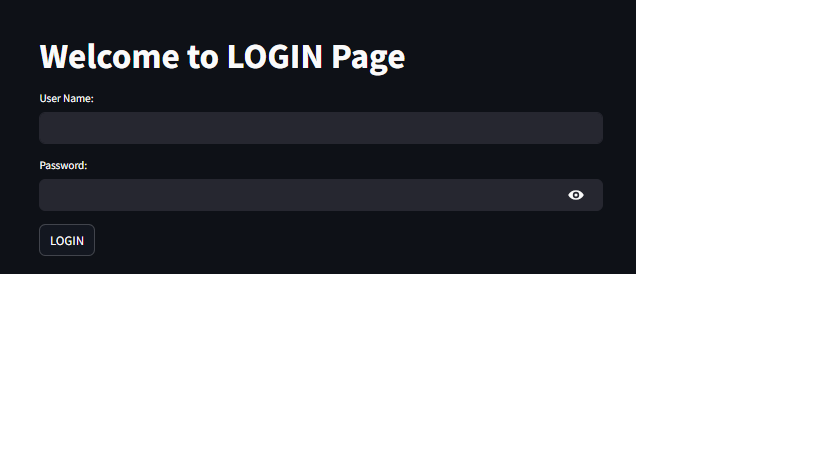
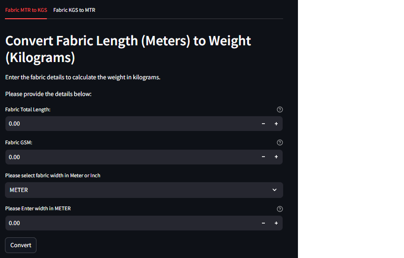

# Fabric Conversion App

A Streamlit-based web application for converting fabric measurements between meters and kilograms. This app includes user authentication and a dashboard for performing fabric conversions.

## Features
- **User Authentication**: Secure login system with username and password.
- **Fabric MTR to KGS Conversion**: Convert fabric length in meters to weight in kilograms.
- **Fabric KGS to MTR Conversion**: Convert fabric weight in kilograms to length in meters.
- **Responsive Design**: Works seamlessly on desktop and mobile devices.

## Screenshots



## How to Run
Follow these steps to run the app locally:

1. **Clone the repository**:
   ```bash
   git clone https://github.com/Fahad-warsi/Python-project.git

2. **Navigate to the project folder:**
    ```bash
    cd fabric-conversion-app

3. **Run the app:**
    ```bash
    streamlit run login.py
4. **Access the app:**
    Open your browser and go to http://localhost:8501.

